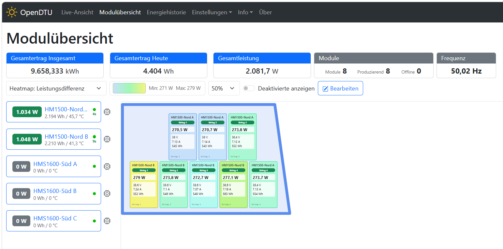
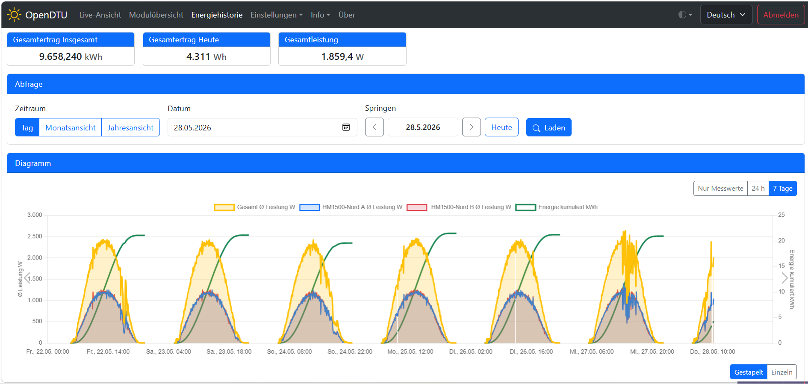

# OpenDTU Fork mit Energiehistorie und Moduluebersicht

Dieser Fork erweitert OpenDTU um zwei groessere Funktionen fuer Anlagen, bei
denen nicht nur Livewerte, sondern auch Verlauf, Modulstatus und eine
anschauliche Modulansicht wichtig sind.

Basis ist weiterhin OpenDTU von tbnobody. Die hier beschriebenen Erweiterungen
sind fork-spezifisch und liegen im Branch `feature/persistent-energy-history`.

## Neuerungen in diesem Fork

### Persistente Energiehistorie

- lokale Speicherung auf LittleFS statt Cloud oder `config.json`
- 5-Minuten-Verlauf fuer Gesamtanlage und einzelne Wechselrichter
- Tages- und Monatsaggregate
- Leistungsdiagramm mit Umschaltung:
  - `Nur Messwerte`
  - `24 h`
  - `7 Tage`
- transparente Pfeilnavigation direkt im Leistungsdiagramm
- Tagesertragsdiagramm mit Monatsnavigation
- Monats- und Jahresvergleich inklusive Summentabelle
- Import, Export, Deep-Scan, Recovery und Loeschen von History-Dateien
- API-Endpunkte unter `/api/energy/history...`
- automatische Aktualisierung fuer aktuelle 5-Minuten-Ansichten

Technische Details zum Dateiformat und zur API stehen in
[docs/EnergyHistory.md](docs/EnergyHistory.md).

### Moduluebersicht

- zweite Live-Ansicht unter `/module-overview`
- frei platzierbare Modulkarten
- Editiermodus mit Raster, Zoom und explizitem Speichern
- Heatmap-Modi fuer Leistung, Tagesertrag und Abweichungen
- optionaler SVG-Hintergrundeditor
- Statusfarben fuer deaktiviert, offline, idle und produzierend
- Anzeige aktueller Modulwerte wie Leistung, Spannung, Strom und Tagesertrag
- Layout-Persistenz in `module_overview.json`

## Wichtiger Hardware-Hinweis

Die Energiehistorie benoetigt zwingend einen ESP32-S3 mit 16 MB Flash.
Ein normaler 4-MB-ESP32 hat nicht genug Flash-Reserve fuer Firmware,
Weboberflaeche und dauerhaft gespeicherte History-Daten.

Empfohlen ist ein ESP32-S3-WROOM-1-N16R8 oder ein kompatibles Board mit:

- ESP32-S3
- 16 MB Flash
- optional PSRAM, empfohlen fuer Reserve
- passender 16-MB-Partitionstabelle


Passende PlatformIO-Umgebungen:

```text
generic_esp32s3_16mb_energy_history
generic_esp32s3_usb_16mb_energy_history
generic_esp32s3_usb_16mb_energy_history_psram
```

Fuer das gezeigte ESP32-S3-WROOM-1-N16R8-Board ist insbesondere diese Umgebung
gedacht:

```text
generic_esp32s3_usb_16mb_energy_history_psram
```

## Screenshots

### Moduluebersicht



### Energiehistorie



## Build

Beispiel fuer das empfohlene 16-MB-ESP32-S3-Board:

```powershell
pio run -e generic_esp32s3_usb_16mb_energy_history_psram
```

Weitere Energy-History-Umgebungen sind in [platformio.ini](platformio.ini)
definiert. Die Energy-History-Builds aktivieren `ENERGY_HISTORY_ENABLE` und
nutzen `partitions_custom_16mb_energy_history.csv`.

## Upgrade- und Migrationshinweise

- Fuer Energy History ist ein kompletter Flash mit der 16-MB-Partitionstabelle
  erforderlich.
- Vor einem Wechsel von einem normalen OpenDTU-Build auf diesen Fork sollte die
  Konfiguration gesichert werden.
- Die gespeicherte Energiehistorie liegt unter `/energy/` auf LittleFS.
- Import/Export der History-Dateien ist ueber die Weboberflaeche moeglich.

## Upstream OpenDTU

Dieses Projekt basiert auf OpenDTU:

- Repository: <https://github.com/tbnobody/OpenDTU>
- Dokumentation: <https://tbnobody.github.io/OpenDTU-docs/>
- Unterstuetzte Wechselrichter:
  <https://www.opendtu.solar/hardware/inverter_overview/>

Das urspruengliche Ziel von OpenDTU bleibt unveraendert: eine lokale,
cloudfreie Alternative zur Hoymiles-DTU.
